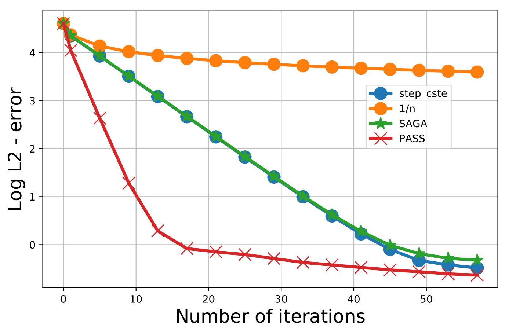
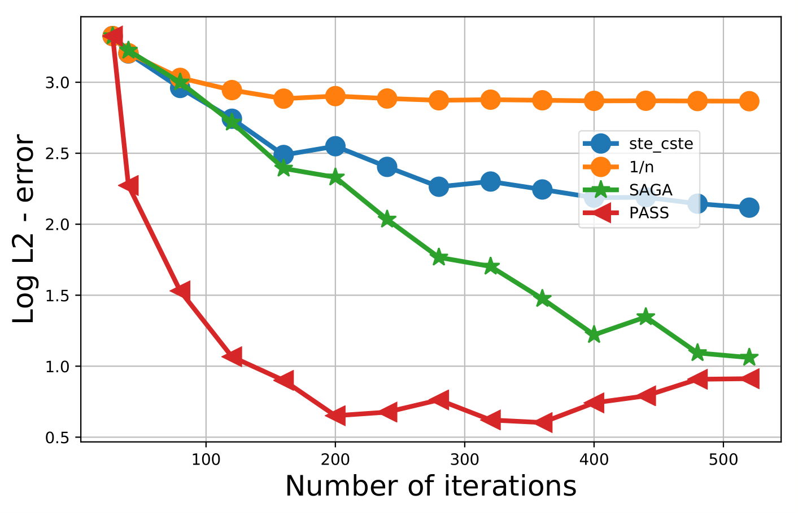
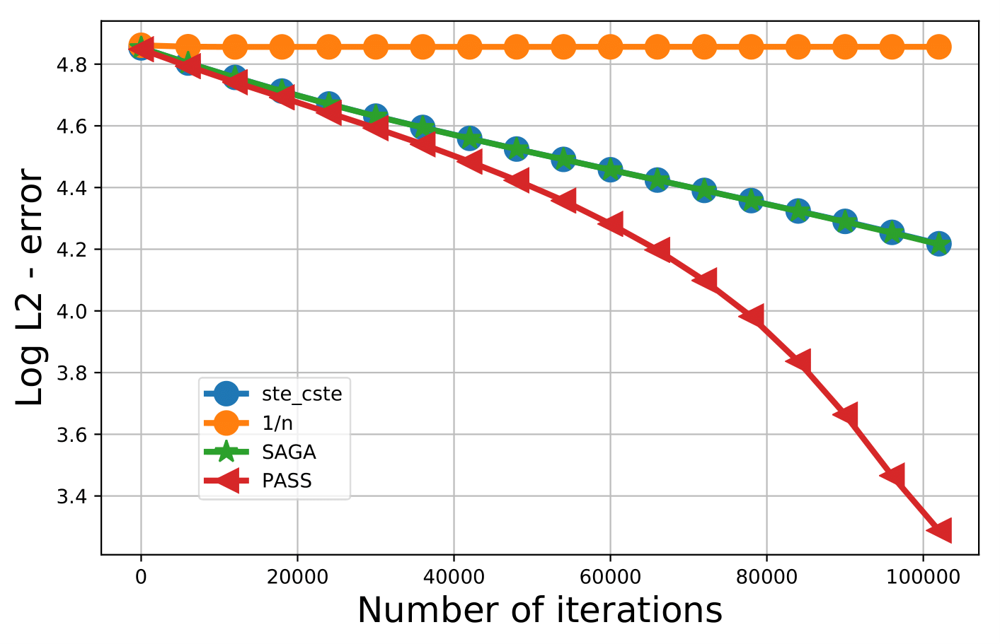
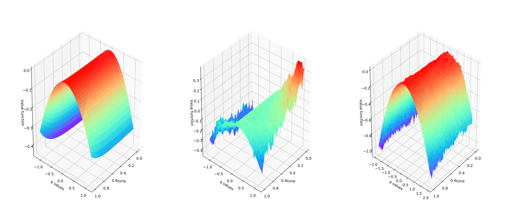

# Pass

This repository primarly aims at improving the convergence speed of some reinforcement learning algorithm using a dynamic learning rate policy. Four different algorithms are implemented:

- **Constant learning strategy:** A constant learning rate is fixed
- **Linear learning strategy:** The learning rate decreases linearly with the number of updates
- **SAGA like algorithm:** An acceleration technique that improves the convergence speed of gradient-like algorithms 
- **PASS:** a strategy that dynamically modifies the learning rate based on the sign changes of the previours errors

## Use cases

Three use cases are considered 
- **Drift estimation:** We start with a simple case that uses stochastic approximation techniques in order to estimate the drift of a discrete stochastic process
- **Optimal placement of a limit order:** An agent aims at buying unit quantity of an instrument during a short time interval using limit and market orders. The agent has to find the best way to minimize the bid-ask spread trading cost
- **Optimal execution of a large number of shares:** An agent wants to find the optimal way to buy a given quantity of an asset during a certain time interval in order to maximize its wealth 

Some tests are added to ensure the correct model implementation and expected learning behaviour 
## Quick Start

Use the commands below to run the code 
```
# Prepare environment
git clone https://github.com/anonymot23/PASS.git
cd PASS

# Sample model run
python testing.optimal_placement.COMPARE_METHODS.main_compare.py
```

## Structure

The code is decomposed into three folders

- **data:** containing the necessary input data.
- **src:** containing necessary code for models' implementation
- **testing:** containing tests and sample models' runs

## Models comparison

For each considered use case, we compare the performance of the implemented algorithms.

### 1- Drift estimation 
The figure below shows the variation of the error when the number of iterations
increases. We can see that the algorithm PASS outperforms other considered
algorithms.

<br />
<div align="center">
  <a href="https://github.com/anonymot23/PASS/blob/main/README.md">
    
  </a>
</div>

### 2- Optimal placement 

The figure below displays the fluctuation of the error as a function of the number of iterations. We can see again that the algorithm PASS outperforms other implemented algorithms.

<br />
<div align="center">
  <a href="https://github.com/anonymot23/PASS/blob/main/README.md">
    
  </a>
</div>

### 3- Optimal execution 
The figure below highlights the error variations when the number of iterations increases. We can see again that the algorithm gives the best performances.

<br />
<div align="center">
  <a href="https://github.com/anonymot23/PASS/blob/main/README.md">
    
  </a>
</div>

Figure below also shows how well the PASS algorithm (rightmost picture) approximates the theoretical solution compared to the constant learning rate strategy (middle picture).

<br />
<div align="center">
  <a href="https://github.com/anonymot23/PASS/blob/main/README.md">
    
  </a>
</div>